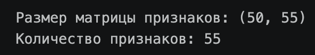
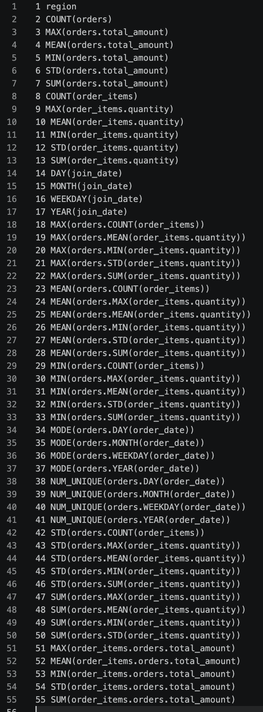

# Практическое задание: Featuretools, Deep Feature Synthesis

Автоматическая генерация признаков для клиентов по четырём связанным таблицам.

## Данные

Синтетические, генерируются в ноутбуке (`np.random.seed(42)`):

| Таблица | Столбцы | Строк |
|---|---|---|
| customers | client_id, name, join_date, region | 50 |
| orders | order_id, client_id, order_date, total_amount | 300 |
| products | product_id, category, price | 20 |
| order_items | item_id, order_id, product_id, quantity | 1000 |

Связи: `customers ──< orders ──< order_items >── products`

## Что сделано

1. Таблицы созданы и загружены в pandas DataFrame.
2. Создан EntitySet `shop` со всеми таблицами и связями.
3. Запущен DFS для `customers` с `max_depth=2`:
   - агрегационные примитивы: sum, mean, count, max, min, std, num_unique, mode;
   - трансформационные примитивы: year, month, weekday, day.

## Результат

Размер матрицы признаков: **(50, 55)**, то есть 50 клиентов и 55 признаков.



Список сгенерированных признаков:



## Запуск

```bash
pip install featuretools jupyter
jupyter notebook featuretools_task.ipynb
```
